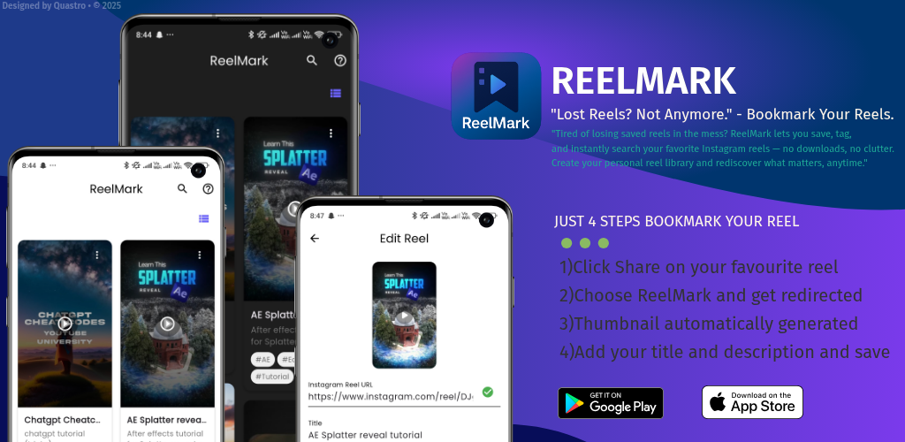
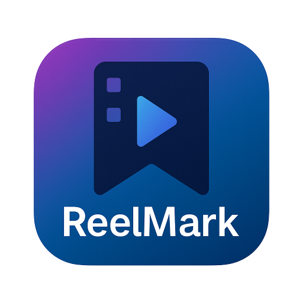
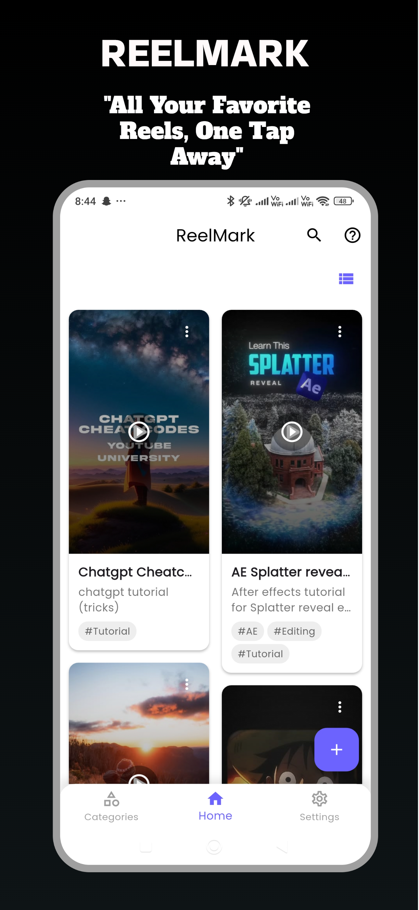
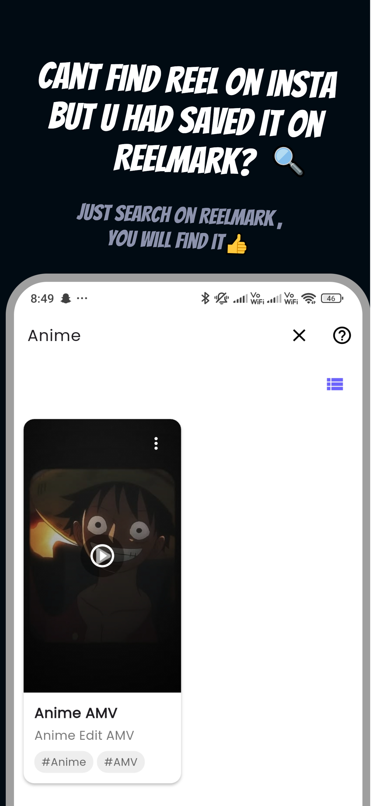
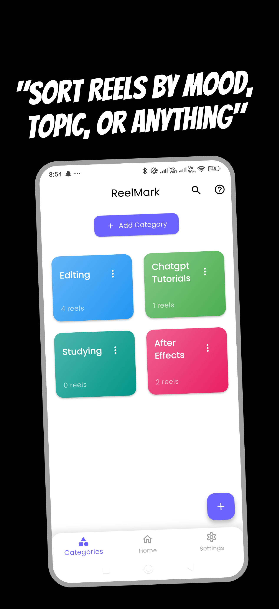
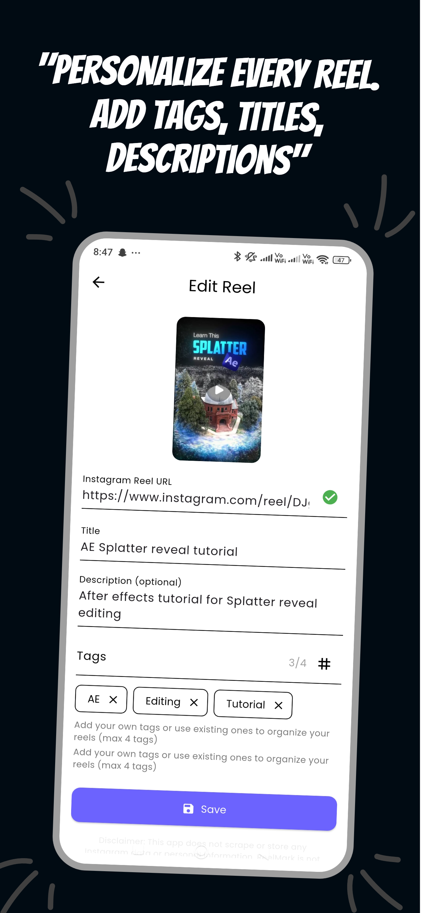
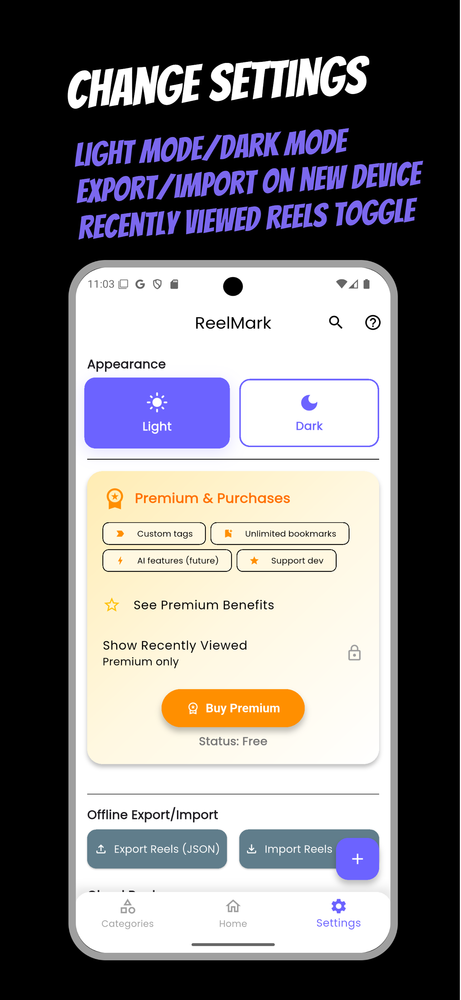
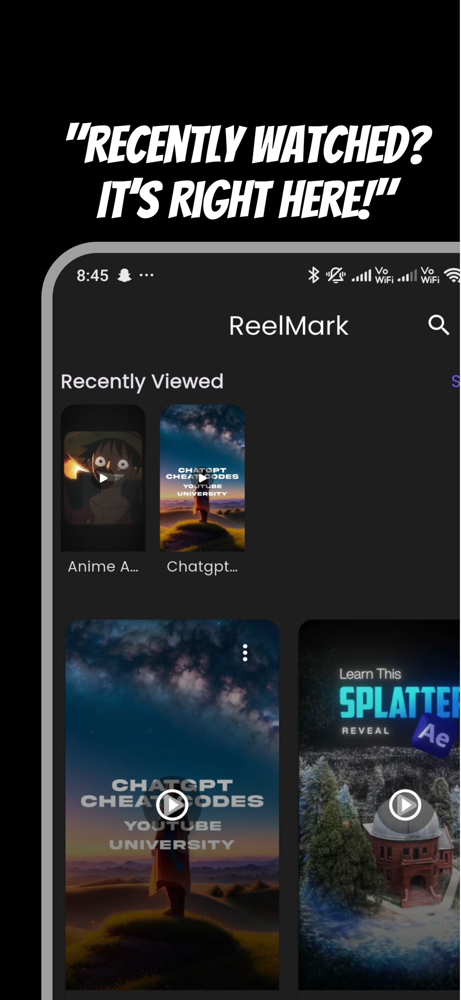
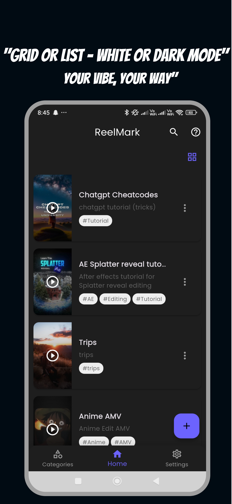
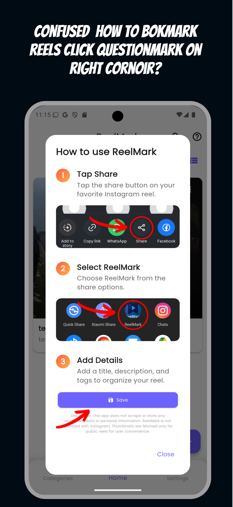

  

# ReelMark - Instagram Reel Bookmarking App

  
  
  
  

  
  
  

## 📱 App Description
ReelMark is a powerful app for android and ios (cross-platform) application that helps you save, organize, and manage your favorite Instagram reels. Available for both Android and iOS, ReelMark provides an intuitive interface and powerful features to make it easy to keep track of your favorite content.

---

## 💡 Inspiration

Scrolling through Instagram, I'd often come across reels that were helpful — like a video editing tip, a tutorial, or creative inspiration. I'd save them using Instagram's native "Save" feature, only to completely forget about them later. When I did try to find them again, I had to scroll endlessly through hundreds of saved reels — many with misleading thumbnails — making it nearly impossible to find the one I wanted.

That's when I realized: Instagram doesn't let you organize or label what you save.

So I decided to fix that.

ReelMark was born out of this simple frustration — a tool that lets you:
- Save reels with titles and tags
- Quickly search and retrieve them later
- Avoid endlessly scrolling and rewatching every saved reel

It's built to feel like your own personal Instagram reel library — searchable, organized, and fast.

---

## 📱 App Icon

  

---

## 🌟 Features

- **Save Instagram Reels**: Easily save reels directly from Instagram
- **Smart Organization**: Automatically categorize reels based on content
- **Premium Features**:
  - Unlimited category management
  - Advanced tagging system
  - Ad-free experience
  - Recently viewed history
- **User-Friendly Interface**: Clean and intuitive design
- **Offline Access**: View saved reels without internet connection
- **Share Functionality**: Share reels with friends and family
- **Cross-Platform**: Available on both Android and iOS

---

## 📸 App Preview

  
  
  
  

  
  
  
  

---

## 🎥 Quick Demo

  
   
  <small>If the GIF doesn't load, <a href="tutorial.gif">click here to view the demo</a></small>

---

## 📥 Download

  
  
  

---

## 🛠️ Technical Stack

- **Framework**: Flutter (Cross-platform)
- **State Management**: Provider
- **Local Storage**: Hive
- **Authentication**: Firebase Auth
- **Analytics**: Firebase Analytics
- **Monetization**: Google AdMob
- **In-App Purchases**: Google Play Billing / App Store Connect

---

## 🤖 Development Journey

This project was developed with the assistance of modern AI tools, which helped in:
- Rapid prototyping and idea validation
- Code optimization and best practices
- UI/UX design refinement
- Feature planning and implementation

The use of AI in development allowed for faster iteration cycles and helped maintain high code quality standards while bringing the app to life.

---

## 🔒 Security & Privacy

- User data is stored locally
- No unnecessary permissions
- Secure authentication
- Privacy-focused design

---

## 📞 Contact

- GitHub: [@Quastro0](https://github.com/Quastro0)
- LinkedIn: Updating Soon..
- Email: quastro.developer@gmail.com

---

## ⭐ Star the Project

If you find this project helpful, please give it a star on GitHub!
